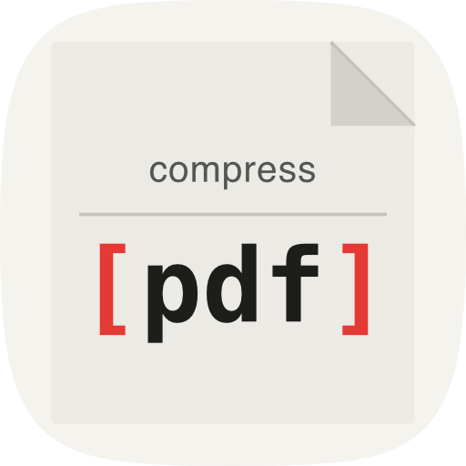

# compress[pdf]

[](LICENSE)

<p align="center">
  
</p>

**Compress PDFs locally. No uploads, no limits, no nonsense.**

## What it does

compress[pdf] compresses PDF files entirely on your Mac — no account, no internet connection, no file size limits. It's a straightforward replacement for cloud tools like iLovePDF and Smallpdf for everyday use, without sending your files anywhere.

## Download

Download the latest release from the [Releases page](https://github.com/JBolanle/PDFCompressor/releases).

## Using the app

1. Add files via drag-and-drop or the File menu
2. Pick a compression preset
3. Optionally override the DPI per file
4. Hit Compress — size savings are shown per file when done

**Presets:**

| Preset   | Quality        | Default DPI |
|----------|----------------|-------------|
| Max      | Smallest file  | 72          |
| Balanced | Good quality   | 150         |
| Minimal  | Near-lossless  | 300         |

Output goes to the same folder with a `_compressed` suffix, or to a custom folder of your choosing.

## For developers

**Stack:**
- Frontend: SvelteKit + Svelte 5 + TypeScript
- Backend: Rust via Tauri 2
- Compression engine: Ghostscript (bundled sidecar binary — no system install required)

**Requirements:**
- [Rust](https://rustup.rs/)
- [Node.js](https://nodejs.org/)

```bash
# Install and run dev server
npm install
npm run tauri dev

# Build for production
npm run tauri build

# Test
npm test                        # Frontend (Vitest)
cd src-tauri && cargo test      # Rust
```

## License

Licensed under the [GNU Affero General Public License v3.0](LICENSE).

This software bundles [Ghostscript](https://www.ghostscript.com/), Copyright © Artifex Software, Inc., licensed under AGPL v3. Source code is available at https://github.com/ArtifexSoftware/ghostpdl
